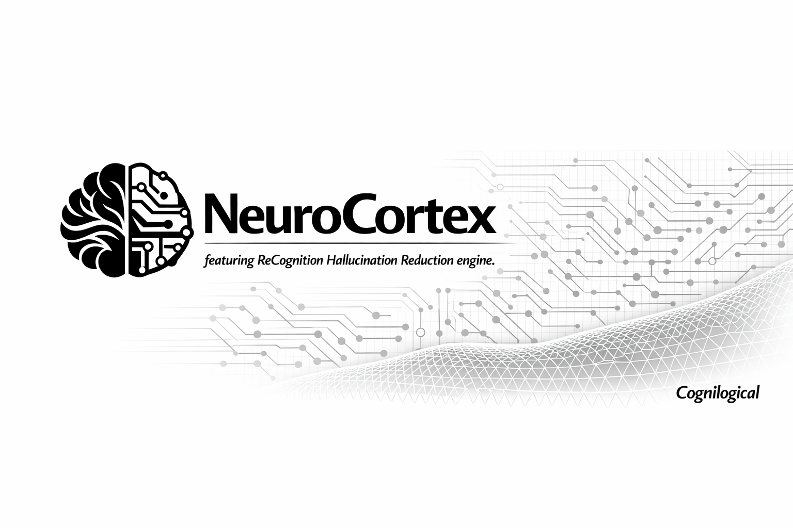

# 🧠 NeuroCortex

  

> **The #1 barrier to enterprise AI isn't context windows. It's trust. I can cure AI hallucination. Watch.**

NeuroCortex is a **CDE (Cognitive Deterministic Engine)**—a simulated physics engine for code. It provides a deterministic reality where AI agents can safely operate, testing their assumptions against actual system constraints. When an agent hallucinates a non-existent package, an incorrect API, or an imaginary flag, NeuroCortex intercepts the action within this reality engine. Instead of failing in production or causing damage on your host OS, the hallucination physically bounces back to the AI, forcing it to self-correct via **ReCognition** before a human ever sees the mistake.

## 🚀 The End of Open-Loop AI

Today's AI coding workflows operate on blind faith: they generate commands and hope they work. NeuroCortex replaces this open-loop generation with a mandatory, deterministic physics engine built on the Model Context Protocol (MCP). Every state-mutating action is evaluated within this engine. Through the power of ReCognition, if an agent hallucinates, it hits the boundaries of our simulated reality, instantly triggering a self-correction loop.

## 📊 Scientific Efficacy: Measuring Hallucination Reduction

NeuroCortex doesn't stop an LLM from *generating* a hallucination—it prevents the hallucination from *taking effect*. By forcing the agent into ReCognition inside a controlled simulation, we observe dramatic drops in realized errors across all frontier models:

*   **Operational/CLI Hallucinations (~85% - 95% Reduction):** Commands invoking imaginary packages or hallucinated flags hit a wall. The engine returns standard POSIX exit codes, instantly triggering ReCognition and forcing the LLM to self-correct.
*   **Contextual & Rule-Based Hallucinations (~70% - 90% Reduction):** NeuroCortex uses local semantic vector search to intercept intents that violate your specific architectural constraints *before* execution.
*   **Code/API Hallucinations (~40% - 60% Reduction):** Hallucinated APIs are caught the moment the agent attempts to run or test the script within the reality engine, preventing cascading failures.

## 🏗️ Architecture

NeuroCortex is a standalone Rust Model Context Protocol (MCP) server, acting as the physics engine for your AI agents. Its core architectural pillars define the boundaries of this reality:

### 1. SynapGuard: The Semantic Interceptor
*   **Local Vector DB:** Powered by embedded **LanceDB**, eliminating external dependencies.
*   **FastEmbed:** Uses `NomicEmbedTextV15` to compute embeddings entirely locally.
*   **Mechanism:** SynapGuard acts as the invisible walls of the physics engine. When an agent proposes an action, SynapGuard checks its vector database. If it violates a constraint, the hallucination hits a wall, bouncing back with a deterministic `SandboxReject` to enforce ReCognition.

### 2. IsoCell: The Ephemeral Sandbox
*   **Rootless Podman:** All actions that pass SynapGuard are executed inside IsoCell, an ephemeral, rootless Podman environment. This is the tangible reality where code is tested safely.
*   **High Concurrency:** Unique container naming and LanceDB's optimistic concurrency control allow dozens of agents to simulate actions simultaneously in their own IsoCells.

### 3. HomeoState: Fail-Open Degradation
*   **Graceful Degradation:** If nested container privileges are missing, HomeoState ensures the architectural design gracefully degrades to keep the agent workflow running smoothly.

## 🛡️ Security & Hardening (OWASP Top 10 for LLMs)

As an enterprise bonus, the deterministic reality provided by NeuroCortex naturally mitigates the most critical vulnerabilities in autonomous AI systems (OWASP Top 10 for LLMs):

*   **Zero Network Attack Surface (Mitigates LLM07):** NeuroCortex operates as a pure stdio MCP server. It listens on zero ports and exposes no external APIs.
*   **Active Secret Scrubbing (Mitigates LLM06):** The Rust-powered backend actively scans payloads for high-entropy secrets (e.g., API keys, passwords). If detected, it explicitly rejects execution, forcing the agent into a "Redaction Loop".
*   **Role-Based Memory Isolation (Mitigates LLM08):** Sandboxed task agents executing within an IsoCell have no network or socket access to the backend, ensuring isolated curation of rules.
*   **Resilient Soft Locks (Mitigates LLM09):** Agents are physically bound by the rules of the engine. They cannot bypass the sandbox, ensuring safe operation even when context degrades.

## 🔌 Integration (MCP)

NeuroCortex operates globally via the Model Context Protocol (MCP). Once registered in your `mcp.json` or `opencode.json`, agents gain immediate access to:
*   `neurocortex_local_guard_validate`: The main entry point for evaluating commands within the physics engine.
*   `neurocortex_learn_behavioral_rule`: The endpoint for teaching the engine new semantic constraints on the fly.